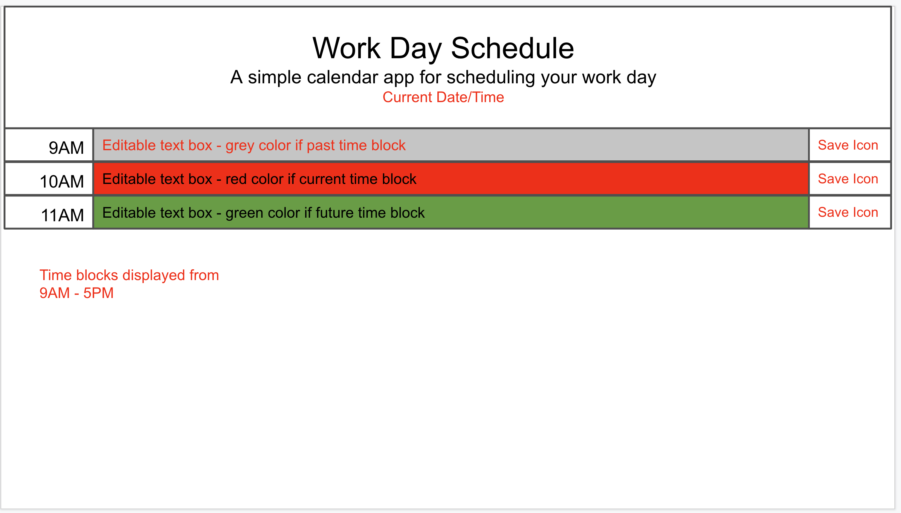

# 05-work-day-scheduler

## Deployed Website

[https://missatrox44.github.io/04-work-day-scheduler](https://missatrox44.github.io/04-work-day-scheduler)

Create a simple calendar application that allows a user to save events for each hour of the day by modifying starter code. This app will run in the browser and feature dynamically updated HTML and CSS powered by jQuery.

You'll need to use the [Moment.js](https://momentjs.com/) library to work with date and time. Be sure to read the documentation carefully and concentrate on using Moment.js in the browser.

## Acceptance Criteria
* The current day is displayed at the top of the calendar
* User is presented with timeblocks for standard business hours
* !!! Each timeblock is color coded to indicated whether it is in the past, present, or future
* User can enter an event when timeblock is clicked into
* User can click save button for that timeblock 
* !!! Text saved into local storage
* !!! When page is refresehd, the saved events persist

---
## How it works
Go to deployed website and select timeblock you wish to edit.
  

## Bugs

* Hopefully none

## Second Set of Eyes

## Resources

* reset.css file reproduced from UT Austin Bootcamp Curriculum. 
* For loop modified from [Foolish Developer](https://dev.to/code_mystery)
* Starter HTML & CSS code provided by UT Austin Bootcamp Curriculum
* Styled with [Bootstrap](https://getbootstrap.com/docs/4.6/getting-started/introduction/)
* Display date/times provided by [Moment JS](https://momentjs.com/)

## Wireframe
  

## MIT License

Copyright (c) 2022 Sara Baqla

Permission is hereby granted, free of charge, to any person obtaining a copy
of this software and associated documentation files (the "Software"), to deal
in the Software without restriction, including without limitation the rights
to use, copy, modify, merge, publish, distribute, sublicense, and/or sell
copies of the Software, and to permit persons to whom the Software is
furnished to do so, subject to the following conditions:

The above copyright notice and this permission notice shall be included in all
copies or substantial portions of the Software.

THE SOFTWARE IS PROVIDED "AS IS", WITHOUT WARRANTY OF ANY KIND, EXPRESS OR
IMPLIED, INCLUDING BUT NOT LIMITED TO THE WARRANTIES OF MERCHANTABILITY,
FITNESS FOR A PARTICULAR PURPOSE AND NONINFRINGEMENT. IN NO EVENT SHALL THE
AUTHORS OR COPYRIGHT HOLDERS BE LIABLE FOR ANY CLAIM, DAMAGES OR OTHER
LIABILITY, WHETHER IN AN ACTION OF CONTRACT, TORT OR OTHERWISE, ARISING FROM,
OUT OF OR IN CONNECTION WITH THE SOFTWARE OR THE USE OR OTHER DEALINGS IN THE
SOFTWARE.
© 2022 GitHub, Inc.
Terms
Privacy
